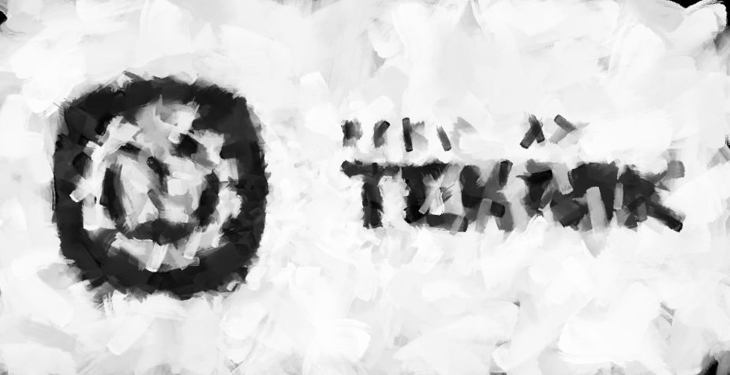

# image-genetic-algorithm
The implementation of image replication using genetic algorithm, coded using Python. This project reference is based on [https://github.com/anopara/genetic-drawing](https://github.com/anopara/genetic-drawing) and is only used for College task purpose.

## Author
Name: **Revando** 
NIM: **2070231027** 
College: **Universitas Krisnadwipayana**

## Output
